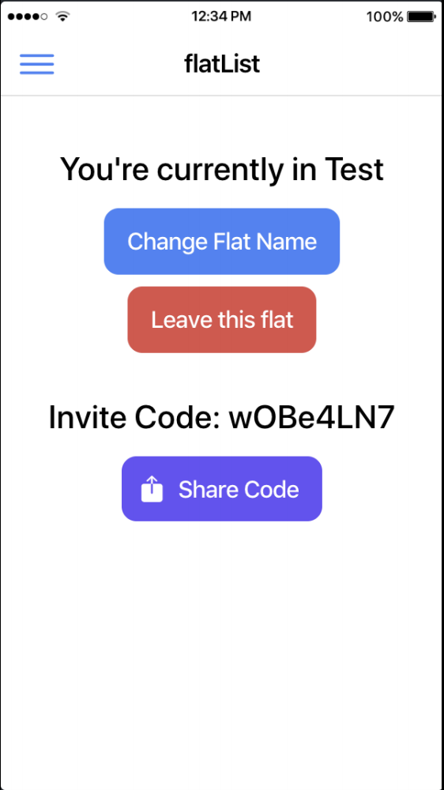
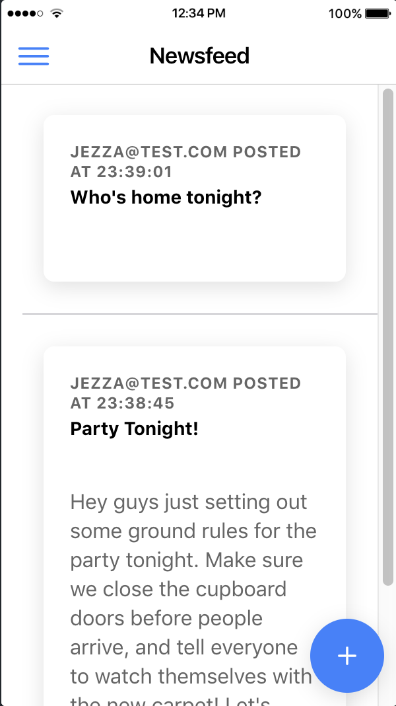
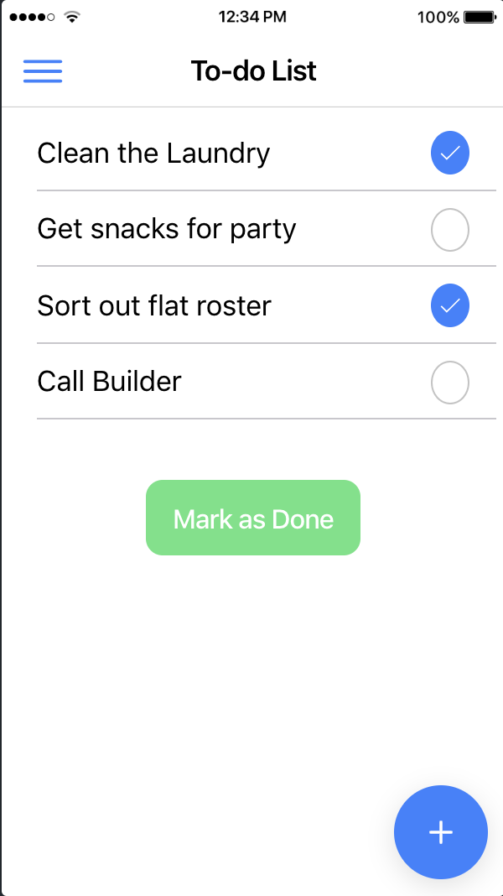

# Flat Manager Application

This is a mobile applcation written in Ionic to help users manage their flat.
It uses Google's firebase for authentication and a RESTful API (which can be found [here](https://github.com/jeremymec/flat-api)) for the backend of the application.

Users can register and login to create 'Flats', groups which they can invite their friends to using an invite code.

This invite code can be shared using the app, or just given to anyone else with the app for them to enter and join the particular flat.

The app has a newsfeed, where members of the flat can post messages and reminders that the other members can see. These can be as simple as "Who's Home?" or optionally can contain a paragraph for more detailed status updates.

The app also has a "todo list", where different members of the flat can post tasks to a shared list. This is a useful way to keep track of things that have to be done in the flat. Any member of the flat can mark as task as done.

The application is functional with the API running on the same server, and can be downloaded and ran. However, it is still in development and their is no offical deployed version as of yet. More features are planned to be added before this happens, so watch this space :)
